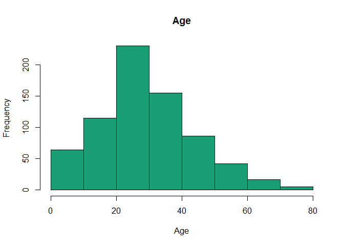
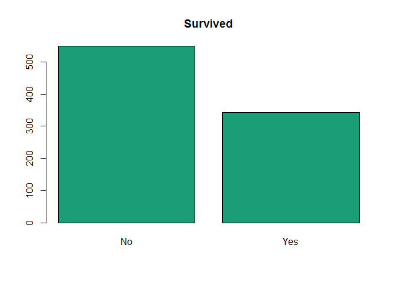
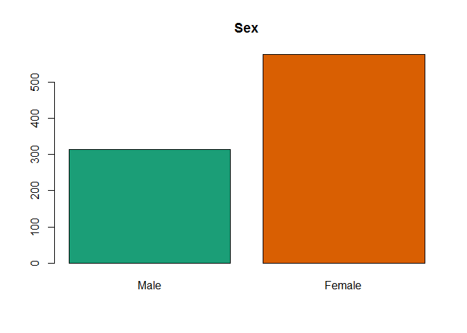
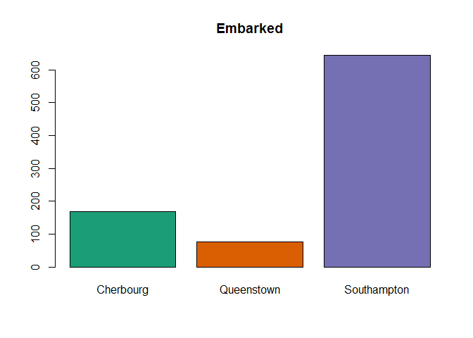
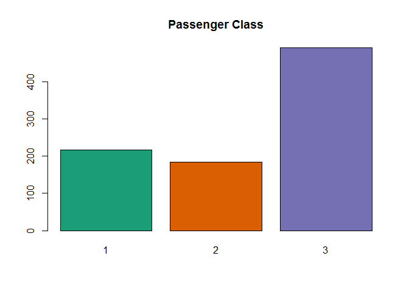
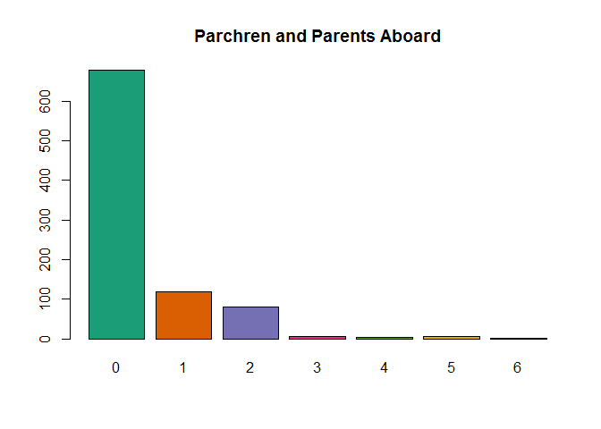
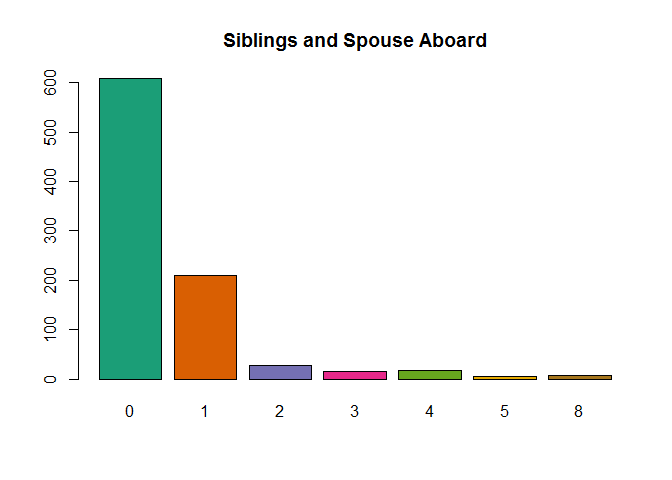

Exploring the Titanic
================

``` r
#Importing setting to flag strings and not have R automatically label char as factors.
df.train <- read.csv("train.csv",
                     stringsAsFactors = FALSE,
                      na.strings=c("NA","") 
                      )

df.test <- read.csv("test.csv",
                    stringsAsFactors = FALSE,
                    na.strings=c("NA","")
                    )

#Creating a place holder column in our df
df.test$Survived = 0 

#combine df
df.full  <- rbind(df.train, df.test) 

#Summary
str(df.full)
```

    ## 'data.frame':    1309 obs. of  12 variables:
    ##  $ PassengerId: int  1 2 3 4 5 6 7 8 9 10 ...
    ##  $ Survived   : num  0 1 1 1 0 0 0 0 1 1 ...
    ##  $ Pclass     : int  3 1 3 1 3 3 1 3 3 2 ...
    ##  $ Name       : chr  "Braund, Mr. Owen Harris" "Cumings, Mrs. John Bradley (Florence Briggs Thayer)" "Heikkinen, Miss. Laina" "Futrelle, Mrs. Jacques Heath (Lily May Peel)" ...
    ##  $ Sex        : chr  "male" "female" "female" "female" ...
    ##  $ Age        : num  22 38 26 35 35 NA 54 2 27 14 ...
    ##  $ SibSp      : int  1 1 0 1 0 0 0 3 0 1 ...
    ##  $ Parch      : int  0 0 0 0 0 0 0 1 2 0 ...
    ##  $ Ticket     : chr  "A/5 21171" "PC 17599" "STON/O2. 3101282" "113803" ...
    ##  $ Fare       : num  7.25 71.28 7.92 53.1 8.05 ...
    ##  $ Cabin      : chr  NA "C85" NA "C123" ...
    ##  $ Embarked   : chr  "S" "C" "S" "S" ...

``` r
#Missing data
sapply(df.full, function(df){
    sum(is.na(df==TRUE) /length(df));
    })
```

    ##  PassengerId     Survived       Pclass         Name          Sex 
    ## 0.0000000000 0.0000000000 0.0000000000 0.0000000000 0.0000000000 
    ##          Age        SibSp        Parch       Ticket         Fare 
    ## 0.2009167303 0.0000000000 0.0000000000 0.0000000000 0.0007639419 
    ##        Cabin     Embarked 
    ## 0.7746371276 0.0015278839

``` r
#Visualize training data
hist(df.train$Age, 
     main = "Age",
     xlab = "Age",
     col="#1B9E77"
     )
```



``` r
barplot(table(df.train$Survived),
        main="Survived",
        names.arg = c("No",
                      "Yes"
                      ),
        col="#1B9E77"
        )
```



``` r
barplot(table(df.train$Sex),
        main = "Sex",
        names.arg = c("Male",
                      "Female"
                      ),
        col=c("#1B9E77",
              "#D95F02"
              )
        )
```



``` r
barplot(table(df.train$Embarked),
        main = "Embarked",
        names.arg =c( "Cherbourg",
                      "Queenstown",
                      "Southampton"
                    ),
        col=c("#1B9E77",
              "#D95F02",
              "#7570B3"
              )
        )
```



``` r
barplot(table(df.train$Pclass),
        main = "Passenger Class",
        col= c("#1B9E77",
               "#D95F02",
               "#7570B3"
               )
        )
```



``` r
barplot(table(df.train$Parch),
        main = "Parchren and Parents Aboard",
        col=c("#1B9E77",
              "#D95F02",
              "#7570B3",
              "#E7298A",
              "#66A61E",
              "#E6AB02"
              )
        )
```



``` r
barplot(table(df.train$SibSp),
        main = "Siblings and Spouse Aboard",
        col=c("#1B9E77",
              "#D95F02",
              "#7570B3",
              "#E7298A",
              "#66A61E",
              "#E6AB02",
              "#A6761D",
              "#666666"
              )
        )
```



``` r
#Post Processing

#Embarked
df.full$Embarked <- as.factor(df.full$Embarked)
summary(df.full$Embarked)
```

    ##    C    Q    S NA's 
    ##  270  123  914    2

``` r
df.full$Embarked[which(is.na(df.full$Embarked))] = 'S'

#Age
summary(df.full$Age)
```

    ##    Min. 1st Qu.  Median    Mean 3rd Qu.    Max.    NA's 
    ##    0.17   21.00   28.00   29.88   39.00   80.00     263

``` r
df.full$Title <- gsub('(.*, )|(\\..*)', '', df.full$Name)

table(df.full$Sex, df.full$Title)
```

    ##         
    ##          Capt Col Don Dona  Dr Jonkheer Lady Major Master Miss Mlle Mme
    ##   female    0   0   0    1   1        0    1     0      0  260    2   1
    ##   male      1   4   1    0   7        1    0     2     61    0    0   0
    ##         
    ##           Mr Mrs  Ms Rev Sir the Countess
    ##   female   0 197   2   0   0            1
    ##   male   757   0   0   8   1            0

``` r
mean.age <- mean(df.full$Age[df.full$Title])

aggregate(df.full$Age,list(df.full$Title),mean)
```

    ##         Group.1     x
    ## 1          Capt 70.00
    ## 2           Col 54.00
    ## 3           Don 40.00
    ## 4          Dona 39.00
    ## 5            Dr    NA
    ## 6      Jonkheer 38.00
    ## 7          Lady 48.00
    ## 8         Major 48.50
    ## 9        Master    NA
    ## 10         Miss    NA
    ## 11         Mlle 24.00
    ## 12          Mme 24.00
    ## 13           Mr    NA
    ## 14          Mrs    NA
    ## 15           Ms    NA
    ## 16          Rev 41.25
    ## 17          Sir 49.00
    ## 18 the Countess 33.00

``` r
df.full$Title[df.full$Title == 'Mlle'] <- 'Miss' 
df.full$Title[df.full$Title == 'Ms'] <- 'Miss'
df.full$Title[df.full$Title == 'Mme'] <- 'Mrs' 
df.full$Title[df.full$Title == 'Dona'] <- 'Mrs' 
df.full$Title[df.full$Title == 'the Countess'] <- 'Mrs'
df.full$Title[df.full$Title == 'Lady'] <- 'Mrs'
df.full$Title[df.full$Title == 'Dr' & df.full$Sex == 'female'] <- 'Mrs'
df.full$Title[df.full$Title == 'Jonkheer'] <- 'Mr' 
df.full$Title[df.full$Title == 'Don'] <- 'Mr' 
df.full$Title[df.full$Title == 'Col'] <- 'Mr' 
df.full$Title[df.full$Title == 'Capt'] <- 'Mr' 
df.full$Title[df.full$Title == 'Major'] <- 'Mr' 
df.full$Title[df.full$Title == 'Rev'] <- 'Mr' 
df.full$Title[df.full$Title == 'Sir'] <- 'Mr' 
df.full$Title[df.full$Title == 'Dr' & df.full$Sex == 'male'] <- 'Mr' 

table(df.full$Sex, df.full$Title)
```

    ##         
    ##          Master Miss  Mr Mrs
    ##   female      0  264   0 202
    ##   male       61    0 782   0

``` r
mean.miss = mean(
                df.full$Age[
                            df.full$Title == 'Miss' & !is.na(df.full$Age)
                            ]
                )

mean.mrs = mean(
                df.full$Age[
                            df.full$Title == 'Mrs' & !is.na(df.full$Age)
                            ]
                )


mean.master = mean(
                df.full$Age[
                            df.full$Title == 'Master' & !is.na(df.full$Age)
                            ]
                )


mean.mr = mean(
                df.full$Age[
                            df.full$Title == 'Mr' & !is.na(df.full$Age)
                            ]
                )

df.full$Age[df.full$Title =='Miss' & is.na(df.full$Age)] <- mean.miss
df.full$Age[df.full$Title =='Mrs' & is.na(df.full$Age)] <- mean.mrs
df.full$Age[df.full$Title =='Master' & is.na(df.full$Age)] <- mean.master
df.full$Age[df.full$Title =='Mr' & is.na(df.full$Age)] <- mean.mr


Fare
```

    ## Error in eval(expr, envir, enclos): object 'Fare' not found

``` r
summary(df.full$Fare)
```

    ##    Min. 1st Qu.  Median    Mean 3rd Qu.    Max.    NA's 
    ##   0.000   7.896  14.450  33.300  31.280 512.300       1

``` r
df.full$FareCat [df.full$Fare < 10 | df.full$Fare == 10] <- 3
df.full$FareCat [df.full$Fare > 10 & df.full$Fare < 20]  <- 2
df.full$FareCat [df.full$Fare > 30]                      <- 1

table(df.full$FareCat, df.full$Pclass)
```

    ##    
    ##       1   2   3
    ##   1 249  41  53
    ##   2   0 145 116
    ##   3   8   7 476

``` r
#using this we can roughly estimate our missing fare value.


est.Fare <- mean(df.full$Fare[df.full$Pclass == df.full$Pclass[is.na(df.full$Fare)] & !is.na(df.full$Fare)])
df.full$Fare[is.na(df.full$Fare)] <- est.Fare

df.full$FareCat [df.full$Fare < 10 | df.full$Fare == 10] <- 3
df.full$FareCat [df.full$Fare > 10 & df.full$Fare < 20]  <- 2
df.full$FareCat [df.full$Fare >= 20]                      <- 1

sapply(df.full, function(df){
    sum(is.na(df==TRUE) /length(df));
    })
```

    ## PassengerId    Survived      Pclass        Name         Sex         Age 
    ##   0.0000000   0.0000000   0.0000000   0.0000000   0.0000000   0.0000000 
    ##       SibSp       Parch      Ticket        Fare       Cabin    Embarked 
    ##   0.0000000   0.0000000   0.0000000   0.0000000   0.7746371   0.0000000 
    ##       Title     FareCat 
    ##   0.0000000   0.0000000

``` r
# So now we have replaced our NA values in Age with our predictions based upon titles. Missing Embarked values were replaced using the mode, which was South Hampton the starting point of the maiden voyage. Fare was estimated using Pclass, and Cabin was left unchanged as there is too much missing data.


df.train <- df.full[1:891,]
df.test <- df.full[892:1309,]

summary(aov(Survived ~ Pclass + Parch + Age + Sex, df.train))
```

    ##              Df Sum Sq Mean Sq F value   Pr(>F)    
    ## Pclass        1  24.14   24.14  166.12  < 2e-16 ***
    ## Parch         1   1.63    1.63   11.20 0.000853 ***
    ## Age           1   8.76    8.76   60.28 2.26e-14 ***
    ## Sex           1  47.42   47.42  326.30  < 2e-16 ***
    ## Residuals   886 128.77    0.15                     
    ## ---
    ## Signif. codes:  0 '***' 0.001 '**' 0.01 '*' 0.05 '.' 0.1 ' ' 1

``` r
glm.survived <-  glm(Survived ~ Pclass + Parch + Age + Sex, family = binomial, data = df.train)
pred.survived <- predict(
                          object = glm.survived,
                          newdata = df.test,
                          type = "response"
                          )
df.test$Survived <- as.numeric(as.numeric(pred.survived)>0.5)
write.csv(df.test[,c("PassengerId", "Survived")],"submit.csv", row.names=F)
```
